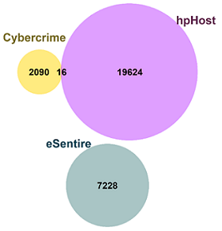
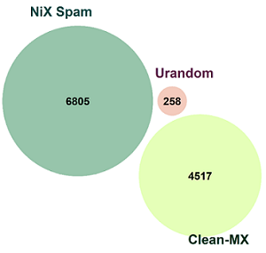
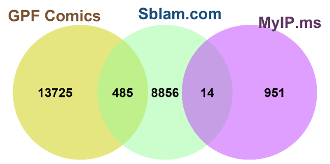

<!-- Text and images style css settings. -->

<style type="text/css">
h1.title
{ 
  font-size: 40px;
  font-family:Lucida Console;
  text-shadow: 1.1px 1.1px #F8E6E0;
  color: White;
  line-height : 20px;
  text-align: center;
}
h3.author
{
  font-size: 32px;
  font-family: Tw Cen MT;
  text-shadow: 1.2px 1.2px #F8E6E0;
  line-height : 5px;
  color: White;
  line-height : 20px;
  text-align: center;
}
h3.date
{
  font-size: 32px;
  font-family: Tw Cen MT;
  text-shadow: 1.2px 1.2px #F8E6E0;
  color: White;
  line-height : 20px;
  text-align: center; 
}
p.titulo
{
  font-size: 32px;
  font-family: Verdana;
  text-shadow: 1.3px 1.2px #006666;
  text-align: center;
  font-style: italic;
  color: #006666;
  margin-bottom: 15px;
}
p.subt
{
  font-size: 25px;
  font-family: Verdana;
  text-shadow: 1.2px 1.2px #006666;
  text-align: center;
  font-style: italic;
  color: #006666;
  margin-bottom: 10px;
  margin-top: 10px;
}
p.p
{
  font-size: 26px;
  font-family: Tw Cen MT;
  text-shadow: 0.9px 0.9/px;
  color: Black;
  line-height : 28px;
  text-align: justify;
}
p.preg
{
  font-size: 28px;
  font-family: Tw Cen MT;
  font-weight: bold;
  color: #006666;
  font-style: italic;
  line-height : 26px;
  text-align: justify;
  margin-left: 60px;
  margin-right: 80px;
  margin-top: 32px;
  margin-bottom: 32px;
}
p.list
{ 
  margin-left: 30px;
  font-size: 21px;
  font-family: Verdana;
  text-shadow: 1.2px 1.2px #4C70AE;
  font-style: italic;
  color: #006666;
  line-height : 28px;
  text-align: justify;
  margin-top: 5px;
  margin-bottom: 10px;
}
p.venn
{
  text-align: center;
  font-size: 22px;
  font-family: Verdana;
  text-shadow: 1.2px 1.2px #4C70AE;
  color: #4C70AE;
  margin-top: 30px;
}
img.derecha
{
  float: right;
  width: 50%;
  border-radius: 15px;
  box-shadow: 10px 8px #a8a3a3;
  margin-left: 24px;
  margin-top: 20px;
  margin-bottom: 15px;
}
</style>


<!-- upload source file and chunk options-->

```{r setup, include=FALSE}
knitr::opts_chunk$set(echo = TRUE)
```
```{r carga fichero source, include=FALSE}
source("./source.R")
```


<!-- This is the first title -->
<p class="titulo">PRACTICA</p>

---------------------------------


<!-- This is text -->
<p class="p">Para desarrollar la actividad práctica del curso nuestro grupo ha seleccionado la temática de *__Threat Intelligence__*, la pregunta que buscamos responder es:</p> 


<!-- This is the question -->
<p class="preg">Are there some types of threats where there is a larger degree of  “agreement”  between different RBLs?</p>


<!-- This is text -->
<p class="p">Para ello hemos tomado 9 diferentes Realtime Blackhole Lists (RBL)  del repositorio de GitHub del proyecto [*__FireHOL__*](https://github.com/firehol/blocklist-ipsets), obtuvimos más de 60.000 IPs catalogadas como amenaza, a partir de allí recolectamos más información relevante para comparamos el porcentaje de coincidencia que existe entre los ipset en función de la categoría a la cual pertenecen y a su ubicación geográfica.</p>  


<!-- This is text -->
<p class="p">A continuación se resume la información sobre los ipset seleccionados para la práctica.</p>  
<br />


<!-- Insert the data description table  -->

```{r table rbls, echo=FALSE}
kable(RBL_table, "html", caption = "Table 1: Data description table") %>%
  kable_styling(bootstrap_options = c("striped", "hover", "condensed", "responsive", fixed_thead = T)
                , full_width = F, position = "center") %>%
  row_spec(0, bold = T, italic = TRUE, color = "White", background = "#4c6f8a", align = "center", font_size = 20) %>%
  row_spec(1:9, color = "black", font_size = 18) %>%
  pack_rows("Malware", 1, 3, label_row_css = "background-color: #c0d6e4; color: #101010; border-bottom: 2px solid;") %>%
  pack_rows("Spam", 4, 6, label_row_css = "background-color: #c0d6e4; color: #101010; border-bottom: 2px solid;") %>%
  pack_rows("Abuse", 7, 9, label_row_css = "background-color: #c0d6e4; color: #101010; border-bottom: 2px solid;")
```
----------------------------------------------
<br />


<!-- This is text -->
<p class="p">Como primer paso para el desarrollo de la practica hemos tomado 9 diferentes Realtime Blackhole Lists (RBL)  del repositorio de GitHub del proyecto [*__FireHOL__*](https://github.com/firehol/blocklist-ipsets), de donde obtuvimos más de 60.000 IPs catalogadas como amenaza, a partir de allí recolectamos más información relevante para determinar el porcentaje de coincidencia que existe entre los ipset en función de la categoría a la cual pertenecen y a su ubicación geográfica.</p>  
<br />


<!-- This is text -->
<p class="subt">Step 1:  Data ingestion</p>

-------------------------------------------

<p class="p">En primer lugar seleccionamos los 9 ipsets divididos en 3 categorías:</p> 
<p class="list"> Malware - Spam - Abuse </p>
<p class="p">Posteriormente realizamos la descarga de los datos, tomamos las IPs, la información más relevante de los encabezados y generamos un data frame por cada fuente.</p>


<!-- This is text -->
<p class="p">A continuación se puede evidenciar la composición de cada uno de estos data frames, para ello seleccione una fuente y numero de observaciones.</p>
<br />


<!-- Insert view datasets app. -->

```{r app datasets, echo=FALSE}
library(shiny)
## app para generar los paneles de seleccion de las fuentes y numero de observaciones, asi como para mostrar la tabla con los resultados. 

ui <- fluidPage(
    titlePanel(h3("Datasets Practica.",
                  style = "font-family: 'Verdana'; line-height: 1.5;
                  text-shadow: 1.2px 1.2px #4C70AE; color: #4C70AE;")),
    sidebarLayout(
        sidebarPanel(
            selectInput(inputId = "dataset",
                        label = "Seleccione el Dataset:",
                        choices = c("Malware 1 - hpHost",
                                    "Malware 2 - Esentire",
                                    "Malware 3 - Cybercrime",
                                    "Spam 1 - NiX Spam",
                                    "Spam 2 - urandom",
                                    "Spam 3 - Clean-MX",
                                    "Abuse 1 - Sblam.com",
                                    "Abuse 2 - MyIP.ms",
                                    "Abuse 3 - GPF Comics")),
            numericInput(inputId = "obs",
                         label = "Numero de observaciones:",
                         value = 10,
                         min = 10,
                         max = 20000,
                         step = 10)),
        mainPanel(
            tableOutput("view"))))

server <- function(input, output) {
    datasetInput <- reactive({
        switch(input$dataset,
               "Malware 1 - hpHost" = dataset_hpHost,
               "Malware 2 - Esentire" = dataset_esentire,
               "Malware 3 - Cybercrime" = dataset_cybercrime,
               "Spam 1 - NiX Spam" = dataset_nixspam,
               "Spam 2 - urandom" = dataset_urandomusto,
               "Spam 3 - Clean-MX" = dataset_cleanmx,
               "Abuse 1 - Sblam.com" = dataset_sblam,
               "Abuse 2 - MyIP.ms" = dataset_botscout,
               "Abuse 3 - GPF Comics" = dataset_gpfcomics)})
    output$view <- renderTable({
        head(datasetInput(), n = input$obs)})}

shinyApp(ui = ui, server = server)
```
<br />
<br />
<br />


<p class="subt">Step 2:  Data Processing</p>
----------------------------------------------

<!-- This is text -->
<p class="p">Una vez cargada la información limpiamos los datasets de datos con valor NA o cero, determinamos la geolocalización de cada IP y generamos los diferentes data frames  necesarios para determinar gráficamente si existe algún grado de coincidencia entre las IPs registradas como amenazas con el fin de cuantificar la confiabilidad de cada fuente en función de su relación con las demás.</p>


<!-- This is text -->
<p class="p">Para este análisis empleamos gráficos como Diagramas de Venn e Histogramas, además de dos aplicaciones que nos permiten interactuar con el contenido de los datasets y la localización geográfica de cada IP.</p>
<br />
<br />
<br />


<!-- This is text -->
<p class="subt">Step 3:  Reporting</p>
-------------------------------------
<!-- Insert venn diagram Malware. -->


<!-- This is text -->
<p class="venn">Venn Diagram category 1: MALWARE</p>

<!-- This is text -->
<p class="p">Como se evidencia en la imagen,  la relación entre las IPs publicadas como Malware por las tres fuentes seleccionadas no nos permita inferir algún grado de confiabilidad sobre estos datos. Tras analizar los datasets creados se logró una coincidencia de menos del 1% en las IPs, lo que hace necesario recolectar más información y realizar más pruebas de correlación.</p>
<br />

<!-- This is text -->
<p class="p">Dado que el Diagrama de venn no nos brindó información útil para determinar la confiabilidad de los datos publicados en los ipsets mantenidos por hpHost, eSential y Cybercrime, hemos tomado los datos referentes a los 5 países con el mayor número de IPs registradas como malware según estas 3 bases de datos. En la gráfica que se presenta a continuación podemos evidenciar que poco más del 30% de estas IPs catalogadas como malware provienen de Estados Unidos, además, alrededor del 20% de las IPs restantes, provienen de Ucrania.</p>
<br />


<!-- Insert bar plot about the Malware datasets countrys. -->
```{r graphic malware, echo=FALSE,  fig.height = 4, fig.width = 7, fig.align = "center"}

ggplot(data=countrys_malware, aes(x=Abrv, y=Freq, fill=Var1)) +
  geom_bar(stat="identity", width = 0.8, colour="black", linetype = "dashed") +
  ggtitle("Plot 1: Countrys Malware IPs") +
  xlab("Countrys") + ylab("IPs") + ylim(0, 10000) +
  geom_text(aes(label = Freq), size=5, color = "black", position = position_stack(vjust = 0.5)) +
  scale_fill_manual(values=c("#f8f9f7", "#fd9893", "#f8f88c", "#93fd98", "#c9e3f4")) +
  theme(
    panel.grid.major = element_blank(),
    plot.background = element_rect(fill = "#f5f5f5"),
    panel.background = element_rect(fill = "#333333", color = "#f5f5f5", size =2, linetype = "solid"),
    legend.background = element_rect(fill = "#f5f5f5"),
    plot.title =  element_text(color="Black", size=14,  face="bold.italic"),
    axis.title.x.top = element_text(color="Black", size=12, face="bold"),
    axis.title.y.left = element_text(color="Black", size=12, face="bold"), 
    legend.title = element_blank(),
    legend.position = "right",
    
    )
```

<br />
<br />
<br />


<!-- Insert venn diagram Spam. -->
  

<!-- This is text -->
<p class="venn">Venn Diagram category 2: SPAM</p>  


<!-- This is text -->
<p class="p">De forma similar al paso anterior, el Diagrama de Venn generado a partir de las tres fuentes seleccionadas como Spam, nos demuestra que no hay ninguna coincidencia entre las más de 11.000 IPs analizadas en esta categoría, por lo tanto,  ya que este resultado no nos permite inferir la confiabilidad de los datos ni su relación. A continuación generamos una gráfica sobre los 5 países con mayor cantidad de IPs catalogadas como Spam según las bases de datos:</p>  
<br />
<br />


<!-- Insert bar plot about the Spam datasets countrys. -->
```{r graphic spam, echo=FALSE,  fig.height = 4, fig.width = 7, fig.align = "center"}

ggplot(data=countrys_spam, aes(x=Abrv, y=Freq, fill=Var1)) +
  geom_bar(stat="identity", width = 0.8, colour="black", linetype = "dashed") +
  ggtitle("Plot 2: Countrys Spam IPs") +
  xlab("Countrys") + ylab("IPs") + ylim(0, 3500) +
  geom_text(aes(label = Freq), size=5, color = "black", position = position_stack(vjust = 0.5)) +
  scale_fill_manual(values=c("#f9b5ca", "#f8f88c", "#fd9893", "#c9e3f4", "#93fd98")) +
  theme(
    panel.grid.major = element_blank(),
    plot.background = element_rect(fill = "#f5f5f5"),
    panel.background = element_rect(fill = "#333333", color = "#f5f5f5", size =2, linetype = "solid"),
    legend.background = element_rect(fill = "#f5f5f5"),
    plot.title =  element_text(color="Black", size=14,  face="bold.italic"),
    axis.title.x.top = element_text(color="Black", size=12, face="bold"),
    axis.title.y.left = element_text(color="Black", size=12, face="bold"), 
    legend.title = element_blank(),
    legend.position = "right",

    )
```

<br />
<br />
<br />


<!-- This is text -->
<p class="p">En esta segunda grafica podemos evidenciar que la tendencia de los países con mayor numero de IPs catalogadas como amenza, para este caso Spam, la lidera Estados Unidos. Los datos procesados nos indican que alrededor del 30% de las amenazas detectadas han provenido de esta región, por lo que podriamos inferir que se debe prestar especial atención al trafico que  provenga de Norteamérica.</p>
<br />
<br />


<!-- Insert venn diagram Abuse. -->


<!-- This is text -->
<p class="venn">Venn Diagram category 3: ABUSE</p>


<!-- This is text -->
<p class="p">Los ipsets seleccionados en la categoría Abuse muestran un comportamiento similar a los anteriores, la convergencia de las IPs no supera el 2% del total de los datos,  en consecuencia, no es posible determinar la confiabilidad de las fuentes seleccionadas a partir de los datos recolectados. Se hace necesario recabar más información y realizar más análisis para dar solucion a la pregunta propuesta en esta actividad.</p>
<br />


<!-- This is text -->
<p class="p">Los 3 ipsets seleccionados para la amenaza categorizada como Abuse, denotan la dominancia de las IPs maliciosas provenientes de Estados Unidos, además, de sobresalir países como Rusia, China y Brazil, entre otros países Europeos y Asiáticos.</p>
<br />


<!-- Insert bar plot about the Abuse datasets countrys. -->
```{r graphic abuse, echo=FALSE,  fig.height = 4, fig.width = 7, fig.align = "center"}

ggplot(data=countrys_abuse, aes(x=Abrv, y=Freq, fill=Var1)) +
  geom_bar(stat="identity", width = 0.8, colour="black", linetype = "dashed") +
  ggtitle("Plot 3: Countrys IPs Abuse") +
  xlab("Countrys") + ylab("IPs") + ylim(0, 5200) +
  geom_text(aes(label = Freq), size=5, color = "black", position = position_stack(vjust = 0.5)) +
  scale_fill_manual(values=c("#93fd98", "#f9b5ca", "#f8f88c", "#fd9893", "#c9e3f4")) +
  theme(
    panel.grid.major = element_blank(),
    plot.background = element_rect(fill = "#f5f5f5"),
    panel.background = element_rect(fill = "#333333", color = "#f5f5f5", size =2, linetype = "solid"),
    legend.background = element_rect(fill = "#f5f5f5"),
    plot.title =  element_text(color="Black", size=14,  face="bold.italic"),
    axis.title.x.top = element_text(color="Black", size=12, face="bold"),
    axis.title.y.left = element_text(color="Black", size=12, face="bold"), 
    legend.title = element_blank(),
    legend.position = "right",

    )
    
    
```

<br />
<br />
<br />


<!-- This is the last part -->
<p class="subt">Geolocation</p>
-------------------------------------


<!-- This is text -->
<p class="p">Por último, para contextualizar los datos analizados podemos determiar la ubicación geográfica de cada una de las IPs que han sido catalogadas como amenaza en las RBLs empleadas para esta actividad. Para ello,  seleccione la fuente que desea consultar en el panel izquierdo de la aplicación que se encuentra a continuación e interactúe con el mapa para determinar la IP y su georeferenciación.</p>  
<br />


<!-- Insert geolocation datasets app. -->

```{r geolocation IPs, echo=FALSE, , fig.width=24}

ui <- fluidPage(
    titlePanel(h3("Datasets Practica.",
                  style = "font-family: 'Verdana'; line-height: 1.5;
                  text-shadow: 1.2px 1.2px #4C70AE; color: #4C70AE;")),
    sidebarLayout(
        sidebarPanel(
            selectInput(inputId = "dataset",
                        label = "Seleccione el Dataset:",
                        choices = c("Malware 1 - hpHost",
                                    "Malware 2 - Esentire",
                                    "Malware 3 - Cybercrime",
                                    "Spam 1 - NiX Spam",
                                    "Spam 2 - urandom",
                                    "Spam 3 - Clean-MX",
                                    "Abuse 1 - Sblam.com",
                                    "Abuse 2 - MyIP.ms",
                                    "Abuse 3 - GPF Comics"))),
           
        mainPanel(
            leafletOutput("map"))))

server <- function(input, output) {
    datasetInput <- reactive({
        switch(input$dataset,
               "Malware 1 - hpHost" = dataset_hpHost,
               "Malware 2 - Esentire" = dataset_esentire,
               "Malware 3 - Cybercrime" = dataset_cybercrime,
               "Spam 1 - NiX Spam" = dataset_nixspam,
               "Spam 2 - urandom" = dataset_urandomusto,
               "Spam 3 - Clean-MX" = dataset_cleanmx,
               "Abuse 1 - Sblam.com" = dataset_sblam,
               "Abuse 2 - MyIP.ms" = dataset_myip,
               "Abuse 3 - GPF Comics" = dataset_gpfcomics)})
    output$map <- renderLeaflet({
       leaflet(datasetInput()) %>% addTiles() %>%
          addMarkers(lng = datasetInput()$Longitud,
                     lat = datasetInput()$Latitud,
                     popup = datasetInput()$IP,
                     icon = MalwareIcon,
                     clusterOptions = markerClusterOptions())})}

shinyApp(ui = ui, server = server)

```
<br />
<br />


-----------------------------------------
<br />

<!-- This is text -->
<p class="p">Como finalización de este breve ejercicio se ha generado el presente reporte, los resultados arrojados tras el procesamiento y análisis grafico de los datos no nos permite inferir una solución a la pregunta planteada inicialmente, sin embargo, si nos permite establecer la relación que tienen el origen de las IPs y su comportamiento malicioso, por lo cual, se hace necesario recolectar más información al respecto para complementar y profundizar el análisis propuesto por el grupo para esta actividad practica .</p>
<br />

<p class="list">PRACTICA / DATA DRIVEN SECURITY</p>
<p class="list">Grupo: Yvette Ramos Oliveau & John Roldan</p>
<p class="list">Enero 2020</p>

<br />


<!-- This is the end of the document -->
<!-- -->
